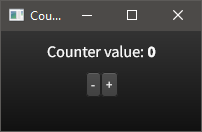
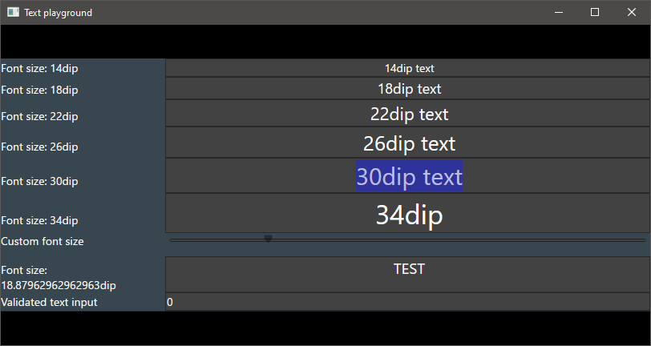

Kyute GUI library
========================================

This is a GUI library in Rust. Inspired by [druid](https://github.com/linebender/druid) and [moxie](https://github.com/anp/moxie).

Uses skia under the hood for rendering.
Currently **windows-only** because it's using DirectWrite for text rendering & paragraph layout.

Features
--------------------------
* Compose widgets with mostly idiomatic and straightforward Rust code
    * Few macros, designed to work well with autocomplete
* The UI is transparently invalidated whenever a piece of state changes. No need for manual change detection and invalidation.
* Widgets
    * Buttons
    * Drop downs (using native menus)
    * Sliders
    * Text line editor & validated text input
    * Images (with async loading & hot-reloading)
    * Scrollable areas
    * Hierarchical table view
    * Simple color picker (WIP)
* Layouts
    * A versatile grid layout container based on CSS grid   
* Live editing of some literals (see below)

Examples
--------------------------

Counter demo



```rust
use kyute::{
  application, composable,
  shell::{
    application::Application,
    winit::{dpi::LogicalSize, window::WindowBuilder},
  },
  style,
  text::{FontWeight, FormattedText},
  widget::{grid::GridLayoutExt, BaseTextEdit, Button, Grid, Text, TextEdit, WidgetExt},
  Alignment, Color, UnitExt, Widget, Window,
};
use kyute_shell::text::FormattedTextExt;
use std::sync::Arc;

// All functions creating widgets or using features like `#[state]` must be marked as `#[composable]`.
#[composable]
fn counter_demo() -> impl Widget {
  // Declare persistent state with `#[state]`.
  // The value will be remembered between invocations of `counter_demo` at the same position in the call tree.
  #[state] let mut counter = 0;

  // Another way of writing the code above without closures:
  //
  //    let button_increment = Button::new("+".to_string());
  //    let button_decrement = Button::new("-".to_string());
  //    if button_increment.clicked() {
  //        counter += 1;
  //    }
  //    if button_decrement.clicked() {
  //        counter -= 1;
  //    }
  //

  // Layout the widgets in a grid.
  //
  // Grids are the primary layout mechanism in kyute.
  // They are modeled after the CSS Grid specification.

  // 2 rows, 40px height.
  // 2 flex columns, available space will be divided evenly among them
  let mut grid = Grid::with_template("40px 40px / 1fr 1fr");
  grid.insert((
    Text::new(format!("Counter value: {}", counter).attribute(14.., FontWeight::BOLD))
            .centered()
            .grid_column_span(2),
    // Buttons to increment and decrement the counter.
    // The framework will detect if the value of `counter` changed, and will re-run the `counter_demo` function if this is the case.
    // Note that the callback passed to `on_clicked` is run immediately, so you can borrow stuff from the surrounding scope.
    Button::new("+")
            .on_click(|| counter += 1)
            .padding(5.dip())
            .horizontal_alignment(Alignment::END)
            .vertical_alignment(Alignment::END),
    Button::new("-")
            .on_click(|| counter -= 1)
            .padding(5.dip())
            .horizontal_alignment(Alignment::START)
            .vertical_alignment(Alignment::END),
  ));

  grid.centered()
          .frame(100.percent(), 100.percent())
          .background("rgb(71 71 71)", style::Shape::rectangle())
          .text_color(Color::from_rgb_u8(200, 200, 200))
}

#[composable]
fn main_window() -> impl Widget {
  // Create the main window widget.
  // For now we use a fork of winit under the hood, hence the `WindowBuilder`.
  Window::new(
    WindowBuilder::new()
            .with_title("Counter demo")
            .with_inner_size(LogicalSize::new(200, 100)),
    counter_demo(),
    None,
  )
}

fn main() {
  application::run(main_window);
}
```

Live-editing of literals
--------------------------

Kyute supports live-editing of some literal expressions in composable functions by adding the `#[composable(live_literals)]`.
When this feature is active, the runtime detects changes in literal values in the source file containing the function, 
and recomposes the user interface automatically to reflect the most recent value.
This is especially powerful when combined with the support of CSS property values in some places:


Screenshots
--------------------------

Hierarchical table view


Text edit



Color picker


